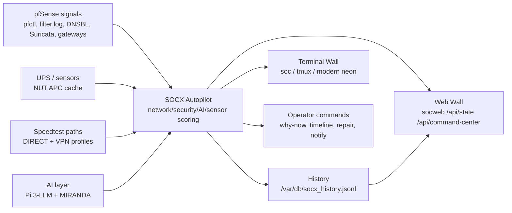

# SOCX Architecture

SOCX is intentionally read-only by default. It watches pfSense and related lab services, explains the current state, preserves evidence on demand, and restarts its own collectors when asked. It does not create firewall rules or block traffic automatically.

## Autonomy Loop

1. Collect live pfSense, Speedtest, UPS, DNSBL, IDS, VPN, Pi AI, and MIRANDA signals.
2. Score the environment into network, security, AI, and sensor health.
3. Write `/tmp/socx-autopilot.env`.
4. Append a compact trend sample to `/var/db/socx_history.jsonl`.
5. Render the result in the terminal wall, browser Command Center, and `socx why-now`.
6. Optionally evaluate `socx notify rules` if a webhook is configured.
